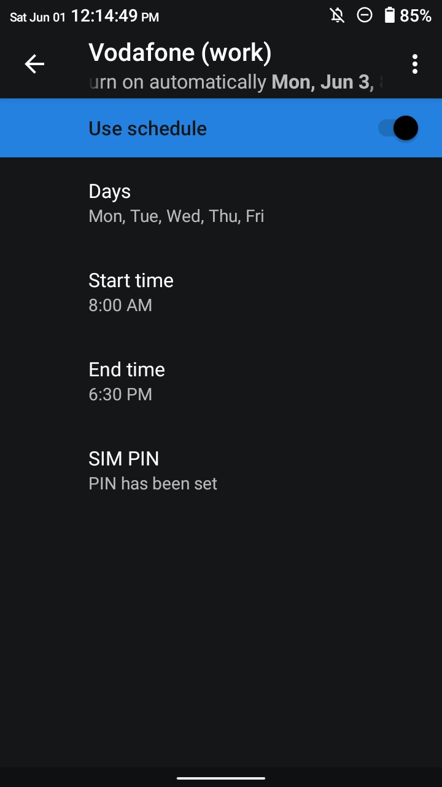

# [7SIM](https://github.com/iusmac/7SIM)

<em>Control SIM cards based on your schedule.</em>


[![Download latest version][releases/latest-badge]][releases/latest] [![License][license-badge]](./LICENSE)

7SIM is an Android privileged app for custom ROMs, aimed to give users more fine-grained control
over their SIM cards.

Technically, this app is an extension of the built-in Settings app. It leverages hidden Android
APIs in order to control SIM card states, etc. By adhering to the Android standardized security
concerns and restrictions, this app require **no root access** at all. This guarantees long-term
maintainability and compatibility across different Android versions.

If you're a ROM maintainer and wish to ship this app as part of your ROM, see
[For ROM Maintainers](#for-rom-maintainers) section.

If you're a normal user willing to give it a try, see [Installation](#installation) section.

> [!NOTE]
> Although the application is still in BETA phrase and under development, the existing functionality
> is stable enough for daily use at this point.

##### Benefits
- Manually activate/deactivate individual SIM cards with just two taps
- or automate this process using the integrated scheduler
- Enhance the "_Do Not Disturb_" mode
- Extend battery life

##### Screenshots
<p>
  
  
  
  
</p>

# Features
- Support of Android 10.0 (Q) and above
- Unlocked capability to turn on/off SIM cards on devices (mainly the old ones) that lacked this
  feature (note that it may not work on some devices due to OEM limitations. Refer to
  [FAQ](#faq) for troubleshooting)
- Add an arbitrary number of schedules per SIM card
  > 🚧 **Work-in-Progress**
  >
  > This feature is already implement "under the hood", but needs UI overhaul. Currently, the UI
  > only supports two schedules (`start` and `end`) that are treated as a single schedule sharing
  > the same days of the week and the <em>Use schedule</em> switch.
  >
  > Subscribe to the iusmac/7SIM/issues/1 to be notified when this feature will be fully
  > implemented.
- Automatically supply the PIN code provided by you to unlock the SIM card
  > 🚧 **Work-in-Progress**
  >
  > This feature is under development. Mostly, the devices lacking the
  > [capability to turn on/off SIM cards out-of-the-box][faq-check-toggle-uicc-subscription-support]
  > need it for the best UX. Because of this, this feature has the highest priority over all other
  > features on the "TO DO" list.
  >
  > Subscribe to the iusmac/7SIM/issues/2 to be notified when this feature will be implemented.
- Automatically detect ongoing call and postpone SIM card deactivation
- Tinted SIM card icons
- Real-Time SIM list updates
- Dark mode support
- "Material You" color palette everywhere (including app icon)
- Compatibility with AOSP build system (see [For ROM Maintainers](#for-rom-maintainers) section)
- Rootless
- Persistent SIM card disabled state across boots
- Hide app icon option ([Why it's grayed out?][faq-show-app-icon-grayed-out])
- Tile to launch the app from the Quick Settings panel
- Available in 40 languages upon release

# Installation
<strong>1.</strong> Ensure you're using a custom ROM running on Android 10.0 (Q) or newer

Maybe you want to know [Why the app cannot be installed on non-custom ROMs, official LineageOS, etc.?][faq-incompatible-with-non-custom-roms-los]

<strong>2.</strong> Download the latest `release.apk` from the [release page][releases/latest]

  > [!TIP]
  > We highly encourage to always verify the checksums of downloaded files. This precautionary
  > measure ensures data integrity, and confirms that the files originated from a trustworthy
  > source since this app is signed with the public Android platform signature.

<strong>3.</strong> Install the app as you would with any other application

<strong>4.</strong> You're all set!

For troubleshooting, refer to the [FAQ](#faq) section.

# Getting Updates
Currently, the updating process follows the same steps as the [Installation](#installation) process.

> [!IMPORTANT]
> You CANNOT update this application using files from the [release page][releases/latest] if the
> "_Updates_" preference is grayed out.
>
> For this see [Why the "Updates" option is grayed out?][faq-updates-grayed-out]

# Help &amp; Feedback
- [Getting Updates](#getting-updates)
- [Quirks You Should Know About](#quirks-you-should-know-about)
- [FAQ](#faq)
- [Q&A][q&a]

# FAQ
> [!TIP]
> If you haven't found an answer to your question, or need further information or clarification,
> please don't hesitate to ask in [Q&A][q&a].

<details>
<summary id="faq-check-toggle-uicc-subscription-support">1. How do I know if my device has the
capability to turn on/off a SIM card out-of-the-box?</summary>

1. Open the SIM details page for a SIM within the built-in Settings app
2. If you observe the `To disable this SIM, remove the SIM card` message in the footer, then your
   device **DOES NOT** have the capability to turn on/off SIM cards out-of-the-box
3. Otherwise, the device is capable of disabling pSIMs and/or eSIMs via the `Use SIM` on/off toggle
   switch, which is expected to be positioned at the top of the SIM details page.

If your device **DOES NOT** has the capability to turn on/off SIM cards out-of-the-box, then the
7SIM app will attempt achieve this by controlling the SIM power state. See also
[Quirks You Should Know About](#quirks-you-should-know-about).
</details>

<details>
<summary id="faq-persistent-in-background">2. Does the app need to always run in the
background?</summary>

No, this app doesn't create any long-lived services and does all the work on-demand. The app is
woken up by the Android OS only when the time comes to process weekly repeat schedules.
</details>

<details>
<summary id="faq-show-app-icon-grayed-out">3. Why is the "<em>Show app icon</em>" option is grayed
out?</summary>

The "_Show app icon_" option is available only if the app is considered by the Android OS as a
system application, i.e., it's either pre-installed in the device's system partition as part of the
ROM, or be deliberately placed in the `/system` partition by the user.

See [Convert the application into a system app](#convert-the-application-into-a-system-app) section.
</details>

<details>
<summary id="faq-how-many-sims-supported">4. How many SIM cards are supported?</summary>

The Android OS provides "out-of-the-box" support for devices with Tri SIM capabilities, that is up
to 3 SIM cards are supported.
</details>

<details>
<summary id="faq-implement-esim-support">5. Would support for eSIM (embedded-SIM) be implemented
soon?</summary>

It's problematic for now, since the eSIM technology isn't widely adopted, and most Android devices
(especially the mid-range ones) and mobile carriers sill don't provide such support.
</details>

<details>
<summary id="faq-meaning-sim-request-failed-error">6. What's the meaning of the error:
<code>SIM request failed (code "errCode")</code>?</summary>

Depending on the Android version, the following modem-related errors are expected to happen on
devices that **DO NOT** have the [capability to turn on/off SIM cards][faq-check-toggle-uicc-subscription-support]
out-of-the-box.

**When running on Android 12.0 (S) or newer versions:**
- `errCode = 2`
   Failed to connect to the modem to make the SIM power state request. This may happen if the modem
   has an error. As per Android's manual, the user may want to make the request again later.
- `errCode = 3`
   Failed to connect to the SIM to make the power state request. This may happen if the SIM has been
   removed. As per Android's manual, the user may want to make the request again later.
- `errorCode = 4`
   Failed to instruct the modem to make the SIM power state. As per Android's manual, this may
   happen if the modem version does not support synchronous power.

   So far, this error is likely to occur on devices running on non-Qualcomm Snapdragon SoCs.

**When running on versions prior to Android 12.0 (S):**
- `errCode = 8`
   SIM card I/O error. SIM card is present but faulty.
- `errorCode = 9`
   SIM Card is present but not usable due to carrier restrictions.
- `errorCode = -2`
   This error is equivalent to `errorCode = 4` on Android 12.0 (S) or newer versions.
</details>

<details>
<summary id="faq-incompatible-with-non-custom-roms-los">7. Why the app cannot be installed on
non-custom ROMs, official LineageOS, etc.?</summary>

Because this app is signed with the public Android platform signature. All privileged apps must be
signed with the same key used for signing the ROM. Any attempts to install this app on a stock ROM
from popular smartphone brands such as Samsung, Huawei, Xiaomi, etc., will fail due to the
certificate mismatch.

Custom ROMs like LineageOS, GrapheneOS, /e/OS, etc., also use a private key for signing their
official builds.

Although individual custom ROM maintainers may sign the ROM using a private key, this is very rare
and uncommon practice. For this reason, the app is distributed as a standalone APK, as it's expected
to install on any custom ROM running on Android 10.0 (Q) or newer ever built.

If you're using a custom ROM that's signed with maintainer's private key, then you can ask them to
include the app in the next OTA release. Direct them to the [For ROM Maintainers](#for-rom-maintainers)
section. Alternatively, consider switching to a different ROM, preferably from a different
maintainer.
</details>

<details>
<summary id="faq-updates-grayed-out">8. Why the "<em>Updates</em>" option is grayed out?</summary>

The "_Update_" option may be grayed out due to the app being signed with the maintainer's private
keys. You cannot update this application using files from the [release page][releases/latest] as
they are signed with the public Android platform signature. Therefore, you can get updates of this
app only from your ROM maintainer with OTA updates.
</details>

# For ROM Maintainers
If you're a ROM maintainer and wish to integrate this app into your ROM, follow these steps:
1. Choose one of the following methods to add the app to the Android sources:
   - As a remote project via [Local Manifests](https://gerrit.googlesource.com/git-repo/+/master/docs/manifest-format.md#Local-Manifests):
     ```xml
     <remote name="iusmac" fetch="https://github.com/iusmac" revision="13.0-dev" />
     <project path="packages/apps/7SIM" name="7SIM" remote="iusmac" />
     ```
   - As an in-tree package within the device tree directory:
     ```sh
     git clone --depth=1 -b 13.0-dev https://github.com/iusmac/7SIM.git
     ```
   - Or better — as Git [Submodule/Subtree](https://training.github.com/downloads/submodule-vs-subtree-cheat-sheet/):
     ```sh
     git submodule add --depth=1 -b 13.0-dev https://github.com/iusmac/7SIM.git
     ```
     OR
     ```sh
     git subtree add --prefix=7SIM https://github.com/iusmac/7SIM.git 13.0-dev --squash
     ```
2. Add app module to a product makefile (e.g., `device.mk`):
   ```
   PRODUCT_PACKAGES += \
       7SIM
   ```
3. That's all! The next time when you'll build the ROM, the _Soong build system_ will pick up the
   app sources and compile it alongside other bundled with the Android platform apps (e.g., Dialer,
   SMS, Settings, etc.). The app will be installed in the `/system_ext/priv-app` directory.

> [!WARNING]
> Before shipping the app to users, please, test assiduously all provided features on your Android
> device to ensure they work as expected.

> [!IMPORTANT]
> If you sign the ROM with your own private keys, users **WILL NOT** be able to get app updates from
> the [release page][releases/latest] due to certificate mismatch, since this app is signed with the
> public Android platform signature. The "_Updates_" option is expected to be grayed out.
>
> Therefore, all future app updates can only be rolled out with **OTA** updates.

> [!TIP]
> Instead of rebuilding the entire ROM for critical bug fixes or new features, consider, inviting
> users to get updates from the [release page][releases/latest], or make your own build of the app
> using the [Soong Build System](#using-soong-build-system), and distribute the APK to your users.
> The app will be installed in the `/data` partition.

# Build From Source
### Using Gradle Build Tool

**Requirements:**
- Android 13 SDK or newer with access to hidden APIs and internal resources
> [!TIP]
> If you don't have one already, you can use our own `android.jar` that you can find at
> [`prebuilts/jars/`](./prebuilts/jars/). Replace it with the stock one in the Android SDK directory.
- Java 17+

**Build process:**

As mentioned above, the 7SIM app is an extension of the built-in Settings app. In order to have the
same UI, and also write less code, it relies on some parts of the
[SettingsLib](https://android.googlesource.com/platform/frameworks/base.git/+/refs/tags/android-13.0.0_r75/packages/SettingsLib/)
package that you can download automatically using this script:
```sh
./SettingsLib/fetch.sh
```
The dependencies will be placed in the same directory where the script is. You can rerun this script
in the future to update the dependencies from the _SettingsLib_ package.

Then, use Android Studio or command line tool to build the APK:
```sh
./gradlew clean build
```

Once the build is finished, you should have the _.apk_ files in the `build/outputs/apk/debug/` and
`build/outputs/apk/release/` directories respectively.

If you want to sign the app with your own private key that you've used to sign the ROM, see the
[`keystore.properties`](./keystore.properties) file.

To enable debug logging on releases with R8, see [Debug Opt-in Logging](#debug-opt-in-logging) section.

### Using Soong Build System
**Requirements:**
- Android 13 and later source code base
> [!NOTE]
> The app stability is not guaranteed when building against the upstream source code base.

**Build process:**

Prepare the environment tools, then use the following command to build the APK only:
```sh
m 7SIM
```
You may have to build the ROM from source at least once before running this command. But you're free
to experiment.

Once the build is finished, you will be shown the path of the _.apk_ file.

To enable debug logging, edit the
[`BuildConfig.java`](./gen/com/github/iusmac/sevensim/BuildConfig.java) file.

# Development
As mentioned above, the 7SIM is a privileged app that leverages Android hidden APIs and accesses
internal resources. During the development, you'll most likely run across the `Cannot resolve symbol`
(or similar) error in Android Studio or standalone LSP servers. For this, you need to replace the
`android.jar` in the Android SDK directory with our own version that you can find at
[`prebuilts/jars/`](./prebuilts/jars/).

There shouldn't be problems when building with Gradle as the library will be picked up via
`compileOnly`.

### Debug Opt-in Logging
The debug logging on releases with R8 can be enabled as follows:
```sh
./gradlew -PreleaseDebugOpt=1 build
```
OR
```sh
RELEASE_DEBUG_OPT=1 ./gradlew build
```
You can either use `1` for true or the word `true`.

### Runtime Debugging
The debug logging can be enabled during runtime as follows:
```sh
setprop service.7sim.debug true
```
OR _persist_ the property to start capturing logs on very early boot process:
```sh
setprop persist.service.7sim.debug true
```
> [!IMPORTANT]
> You need _su_ privileges to run the above commands, or edit the `/system/build.prop` file via
> recovery as an alternative.
>
> The app **needs** to be restarted to pick up new changes.

---

The device's [capability to disable / re-enable a physical (non-eUICC) SIM][faq-check-toggle-uicc-subscription-support],
even if availability is configured by the platform, and instead opt for slot power control as a
fallback method to toggle SIM card states, can be achieved as follows:
```sh
setprop service.7sim.debug.uicc_sub_toggle_disabled true
```
This property can be persistent.
> [!IMPORTANT]
> Remember to enable all SIM cards first before switching to a different method.
>
> Support for slot power control isn't guaranteed due to OEM limitations.
>
> You need _su_ privileges to run the above command, or edit the `/system/build.prop` file via
> recovery as an alternative.
>
> The app **needs** to be restarted to pick up new changes.

# Convert the Application Into a System App
A privileged user app is considered by the Android OS as a system application, when it's located in
a `priv-app` directory on the device's system partition.
> [!NOTE]
> As of now, this app doesn't require to be installed in the system partition to properly function,
> but some features such as the "_Show app icon_" option need it.

In order to convert the application into a system app, follow these steps:
#### 1. Copy the APK
Download the latest `release.apk` from the [release page][releases/latest] and place it in the
/system partition depending on the Android version:
- when running on Android 11.0 (R) or newer versions: `/system/system_ext/priv-app/7SIM/7SIM.apk`
- when running on versions prior to Android 11.0 (R): `/system/priv-app/7SIM/7SIM.apk`

Note: if using recovery, the mount point may vary across different recoveries:
`/mnt/system`, `/system_root`, `/system`—for example, `/system_root/system/system_ext/priv-app/7SIM/7SIM.apk`.

> [!IMPORTANT]
> You may also need to set permissions to `644` and the SELinux label to `u:object_r:system_file:s0`
> (e.g., via `chcon` command) for the file. If using recovery, this should be handled under the
> hood, but this isn't guaranteed if the recovery is very old.

#### 2. Grant Privileged Permissions
Download and place the [privapp_whitelist_com.github.iusmac.sevensim.xml](./privapp_whitelist_com.github.iusmac.sevensim.xml)
file in the /system partition depending on the Android version:
- when running on Android 11.0 (R) or newer versions: `/system/system_ext/etc/permissions/`
- when running on versions prior to Android 11.0 (R): `/system/etc/permissions/`

Note: if using recovery, the mount point may vary across different recoveries:
`/mnt/system`, `/system_root`, `/system`—for example, `/system_root/system/system_ext/etc/permissions/`.
> [!CAUTION]
> Starting from Android 9.0 (P), as per [Privileged Permission Allowlist](https://source.android.com/docs/core/permissions/perms-allowlist)
> article, the presence of the file with permissions is mandatory when converting a privileged user
> app into a system app, otherwise the device will **bootloop** indefinitely.

#### 3. Add Survival Addon Script
To ensure the survival of the above files during ROM re-flashes and OTA updates, place the
[prebuilts/addon.d/50-7SIM.sh](./prebuilts/addon.d/50-7SIM.sh) file in
`/system/addon.d/` directory. No need to give it execution permissions.

Note: if using recovery, the mount point may vary across different recoveries:
`/mnt/system`, `/system_root`, `/system`—for example, `/system_root/system/addon.d/50-7SIM.sh`.

> [!NOTE]
> This requires ROM with addon.d support, i.e, the presence of the `/system/addon.d` directory,
> also of the `install` directory in the ROM's zip when flashing.
>
> Most custom ROMs support this out-of-the-box.

#### 4. That's It!
This process must be done only once. To get updates, simply install the app as described in
[Installation](#installation) section; the application will exist in both the system and data
partitions, and the newest one will be used.

> In the future, maybe we'll make the APK to be recovery-compatible to do the above steps
> automatically.

> [!IMPORTANT]
> If the ROM's system partition is **read-only** (e.g., formatted with EROFS), then the only option
> you have is to ask the ROM maintainer to include the app in the next OTA release. Direct them to
> the [For ROM Maintainers](#for-rom-maintainers) section.

# Quirks You Should Know About
Below are some quirks specific to the devices that **DO NOT** have the
[capability to turn on/off SIM cards][faq-check-toggle-uicc-subscription-support] out-of-the-box you
that should be aware of.

#### 1. SIM Card Showing in the SIM List After Being Ejected
If the SIM card is turned off and then ejected, it will be still showing in the SIM card list. This
is because, as mentioned earlier, the devices lacking the [capability to turn on/off SIM cards][faq-check-toggle-uicc-subscription-support]
out-of-the-box, opt for SIM slot power control method to turn off SIM cards, so powering down a SIM
card (or, more precisely its corresponding SIM slot that hosts it), is akin to remove it physically
(the SIM card is expected to completely vanish from the system). Due to this, the SIM card will be
showing in the SIM list until turned on. If the SIM card is ejected then turned on, it should
disappear from the SIM list.

#### 2. No Automatic SIM Card State Sync After Airplane Mode Disabled
If a SIM card is turned off and the device is switched into Airplane Mode, any schedule attempting
to turn on the SIM card will be ignored, which is the expected behavior. After exiting Airplane
Mode, the SIM card **WILL NOT** automatically turn on if it's supposed to as per schedules. This is
because the Android OS doesn't notify apps of Airplane Mode state changes unless the app explicitly
subscribes to these changes and remains working in the background. Since this app was developed on
purpose to not waste system resources and do all the work on-demand, there is currently no
workaround to this.

# Contributing
### Contribute Code
You are welcome to contribute to the project!

Note that, this app was developed to be long-term maintainable and compatible across different
Android versions. During development, we prioritize adherence to Android's standardized security
concerns and restrictions as much as possible. That's said, before opening any PR with new features
or bug fixes, please open an issue to discuss the changes first.

### Translate
You can help translate 7SIM here [on GitHub](./res). Here are a few tips:
- Only strings without `translatable="false"` attribute are eligible for translation, for example:
  ```xml
  <string name="app_name">"7SIM"</string>
  ```
  whereas this shouldn't be translated:
  ```xml
  <string name="app_name" translatable="false">"7SIM"</string>
  ```
- When using [ellipsis](https://en.wikipedia.org/wiki/Ellipsis) (dot dot dot), insert `…` instead.
- When using quotation marks, insert the symbols specific to the target language (if available), as
  listed in [this table](https://en.wikipedia.org/wiki/Quotation_mark#Summary_table).
- When using the regular ASCII single quote mark, double quote everything, for example:
  ```xml
  <string name="my_string">"This is an 'example' string."</string>
  ```
- 7SIM uses [title case](https://en.wikipedia.org/wiki/Title_case) for some English UI text. Title
  case isn't used in other languages; opt for [sentence case](https://en.wikipedia.org/wiki/Letter_case#Sentence_case)
  instead.

<!--
  Aliases for reusable links
  Usage:
    [Go to "example.com"][alias-name]
    ...
    [alias-name]: https://example.com
-->
[faq-check-toggle-uicc-subscription-support]: #user-content-faq-check-toggle-uicc-subscription-support
[faq-persistent-in-background]: #user-content-faq-persistent-in-background
[faq-show-app-icon-grayed-out]: #user-content-faq-show-app-icon-grayed-out
[faq-how-many-sims-supported]: #user-content-faq-how-many-sims-supported
[faq-implement-esim-support]: #user-content-faq-implement-esim-support
[faq-meaning-sim-request-failed-error]: #user-content-faq-meaning-sim-request-failed-error
[faq-incompatible-with-non-custom-roms-los]: #user-content-faq-incompatible-with-non-custom-roms-los
[faq-updates-grayed-out]: #user-content-faq-updates-grayed-out
[releases/latest]: https://github.com/iusmac/7SIM/releases/latest
[releases/latest-badge]: https://img.shields.io/github/v/tag/iusmac/7SIM?sort=semver&style=for-the-badge&labelColor=ffddb4&logoColor=4f4539&logo=DocuSign&label=Download&color=f6c695
[license-badge]: https://img.shields.io/github/license/iusmac/7SIM?style=for-the-badge&labelColor=ffddb4&logoColor=4f4539&color=f6c695
[q&a]: https://github.com/iusmac/7SIM/discussions/categories/q-a
